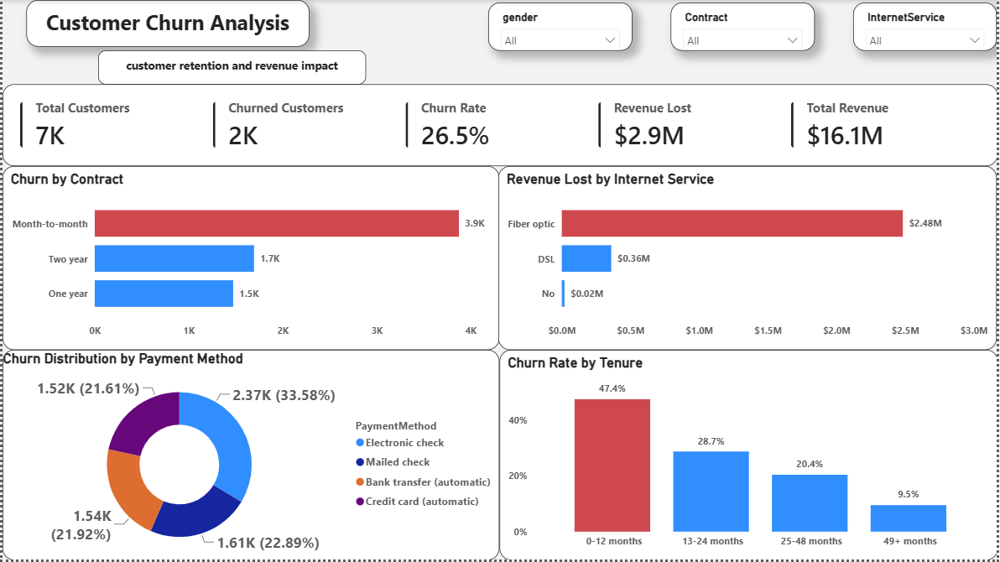
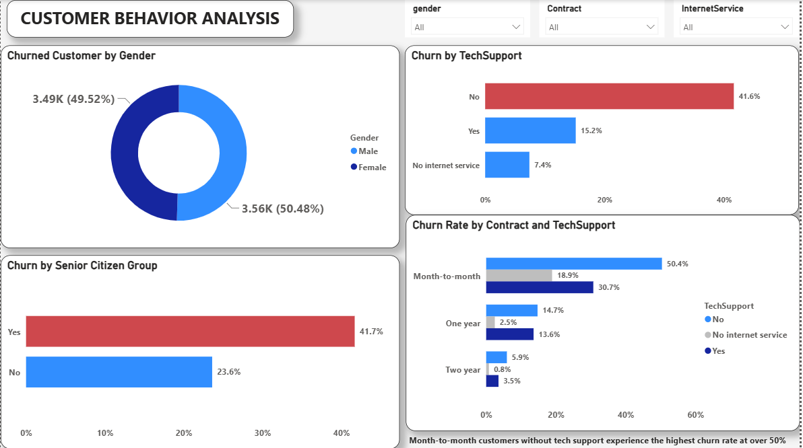
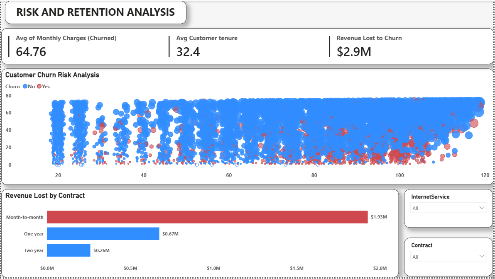

# 📉 Customer Churn Analysis Dashboard (Power BI)

## 📌 Project Overview

This project analyzes customer churn behavior to identify customer retention challenges, revenue loss drivers, and high-risk customer segments.

Using Power BI, the dashboard provides actionable insights into customer contracts, tenure, internet services, payment methods, and retention patterns to support data-driven business decisions.

---

# 🎯 Business Problem

Customer churn reduces revenue and increases customer acquisition costs.

The goal of this analysis is to:

* Understand why customers leave
* Identify high-risk customer segments
* Measure revenue impact from churn
* Improve customer retention strategies

---

# 📊 Dashboard Structure

## Page 1: Customer Retention & Revenue Impact

Key Metrics:

* Total Customers
* Churned Customers
* Churn Rate
* Revenue Lost
* Total Revenue

Analysis:

* Churn by Contract
* Revenue Lost by Internet Service
* Churn Distribution by Payment Method
* Churn Rate by Tenure

### 📸 Executive Overview

---

## Page 2: Customer Behavior Analysis

Analysis focuses on:

* Customer demographics
* Service subscriptions
* Contract behavior
* Payment preferences
* Customer churn drivers

### 📸 Customer Behavior Analysis

---

## Page 3: Risk & Retention Analysis

Analysis focuses on:

* High-risk customer groups
* Retention opportunities
* Customer segmentation
* Revenue impact assessment

### 📸 Risk & Retention Analysis

---

# 🔍 Key Insights

* Month-to-month contracts experience the highest churn.
* Fiber optic customers contribute the largest share of revenue loss.
* Customers within their first 12 months show the highest churn rate.
* Electronic check users exhibit higher churn behavior.
* Customer retention improves significantly with longer tenure.

---

# 💡 Business Recommendations

* Encourage migration from month-to-month contracts to longer-term plans.
* Improve onboarding programs for new customers.
* Develop targeted retention campaigns for high-risk customer groups.
* Investigate customer experience issues within fiber optic services.
* Introduce loyalty and rewards programs to improve customer retention.

---

# 🛠️ Tools & Skills Used

* Power BI
* DAX
* Data Modeling
* Data Visualization
* Business Intelligence
* Data Storytelling

---

# 👨‍💼 Author

**Oluwasegun Sunday Owolabi**

Data Analyst | Power BI | SQL | Excel

GitHub: https://github.com/sowolabi07
